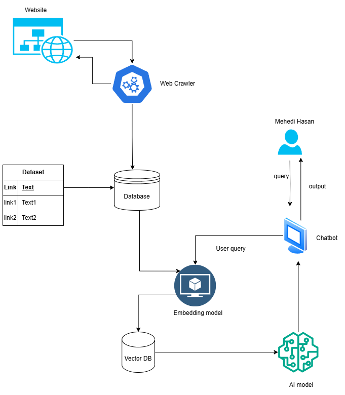

# **Web Scraping and Query Matching Chatbot**

<figure>
  
  <figcaption>System Architecture Diagram</figcaption>
</figure>

This document describes a project that implements a chatbot capable of scraping website data, embedding the scraped text into a vector database, and using the stored embeddings to find the most relevant link based on user queries.
## **Overview**

The project combines the following technologies and methodologies:
1. Web scraping for extracting text and links from a specified website.
2. Vector database (ChromaDB) to store and query embeddings of the scraped text.
3. Sentence-Transformers to generate embeddings for text and user queries.
4. A chatbot interface for querying the data and retrieving the most relevant link.

## **Key Features**
- **Daily scraping of website data.**
- **Embedding text using a pre-trained Sentence-Transformers model.**
- **Querying embeddings for relevance matching.**
- **User-friendly chatbot interface.**
- **Saves users time by providing the exact link they want.**

## **Project Workflow**

### **1. Scraping Website Data**
A `daily_scraper` function is used to scrape text and links from a specified website. This function is imported from the `WebChatbot.daily_scrapping` module.

### **2. Initializing ChromaDB Client and Embedding Function**
- **ChromaDB is used to store the embeddings of the scraped data.**
- **Sentence-Transformer model (`paraphrase-MiniLM-L6-v2`) generates embeddings for text and user queries.**

### **3. Storing Data in ChromaDB**
- A ChromaDB collection named `links` is created to store the scraped data.
- Each text and its corresponding link is embedded and stored with a unique ID.

### **4. Query Matching**
- User queries are embedded using the same Sentence-Transformer model.
- The embedded query is matched against the stored embeddings in ChromaDB.
- The most relevant link is returned to the user.

## **How It Works**
1. The user specifies a website link, and the `daily_scraper` function scrapes the data.
2. The scraped text and links are embedded and stored in ChromaDB.
3. The user enters a query through the chatbot interface.
4. The chatbot uses the embedded query to find the most relevant link from the vector database.

## **Requirements**
- **Python**
- **ChromaDB**
- **Sentence-Transformers**
- **tqdm**

## **Usage**
1. Run the script.
2. Input the website link to scrape.
3. After the data is processed, interact with the chatbot to find relevant links based on your queries.
4. Type `exit` to stop the chatbot.

## **Benefits**
- **Saves users time by providing the exact link they want without manually searching the website.**
- **Offers a seamless and efficient way to find specific information.**

## **Future Enhancements**
- **Add support for multilingual queries.**
- **Incorporate more advanced embedding models for better relevance matching.**
- **Implement a web-based interface for improved user experience.**

## **License**
[Insert License Details Here]

## **Contribution**
Feel free to fork the repository, submit issues, or create pull requests for improvements.
